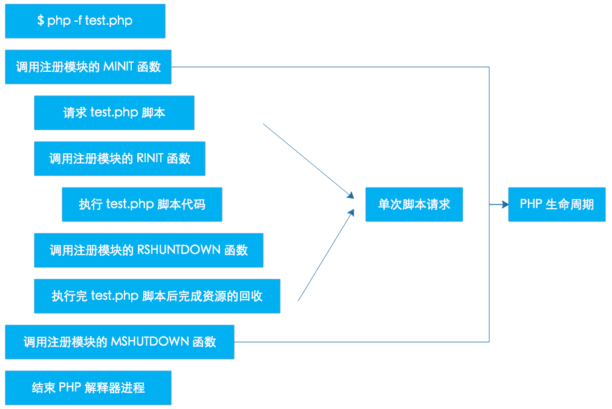
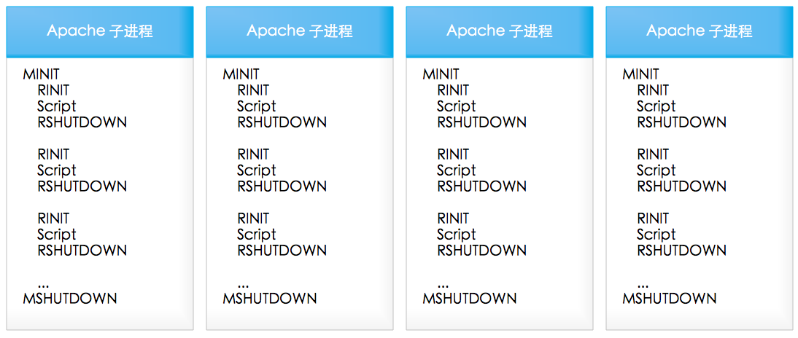
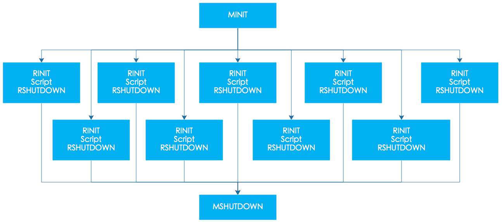

`PHP`在单线程，多进程和多线程的`SAPI`环境下加载扩展的时候都有标准的初始化和销毁过程，我们将其称为扩展模块的生命周期(module cycle)。现在我们简单的说一下`PHP`两种模式下的初始化和销毁的流程。
说明：我们这篇文章中大量引用了 《深入理解PHP内核》这本书中的`PHP 生命周期`章节, 感谢 TIPI 团队为我们提供这么优质的文章。
> [阅读《深入理解PHP内核》原文](http://www.php-internals.com/book/?p=chapt02/02-01-php-life-cycle-and-zend-engine)

### 单进程 SAPI 生命周期
`CLI/CGI`模式的`PHP`属于单进程的`SAPI`模式。这类的请求在处理一次请求后就关闭。也就是只会经过如下几个环节： 开始 - 请求开始 - 请求关闭 - 结束 `SAPI`接口实现就完成了其生命周期。如图所示：



如上的图是非常简单，也很好理解。只是在各个阶段之间PHP还做了许许多多的工作。这里做一些补充：

#### 启动
在调用每个模块的模块初始化前，会有一个初始化的过程，它包括：

1. 初始化若干全局变量
这里的初始化全局变量大多数情况下是将其设置为`NULL`，有一些除外，比如设置`zuf（zend_utility_functions）`， 以`zuf.printf_function = php_printf`为例，这里的`php_printf`在`zend_startup`函数中会被赋值给`zend_printf`作为全局函数指针使用， 而`zend_printf`函数通常会作为常规字符串输出使用，比如显示程序调用栈的`debug_print_backtrace`就是使用它打印相关信息。
2. 初始化若干常量
这里的常量是PHP自己的一些常量，这些常量要么是硬编码在程序中,比如`PHP_VERSION`，要么是写在配置头文件中， 比如`PEAR_EXTENSION_DIR`，这些是写在`config.w32.h`文件中。
3. 初始化 Zend Engine 和核心组件
前面提到的`zend_startup`函数的作用就是初始化`Zend Zend`，这里的初始化操作包括内存管理初始化、 全局使用的函数指针初始化（如前面所说的`zend_printf`等），对PHP源文件进行词法分析、语法分析、 中间代码执行的函数指针的赋值，初始化若干`HashTable`（比如函数表，常量表等等），为`ini`文件解析做准备， 为`PHP`源文件解析做准备，注册内置函数（如`strlen`、`define`等），注册标准常量（如`E_ALL`、`TRUE`、`NULL`等）、注册`GLOBALS`全局变量等。
4. 解析 php.ini
`php_init_config`函数的作用是读取 `php.ini` 文件，设置配置参数，加载`zend`扩展并注册`PHP`扩展函数。此函数分为如下几步： 初始化参数配置表，调用当前模式下的`ini`初始化配置，比如`CLI`模式下，会做如下初始化：
```cpp
INI_DEFAULT("report_zend_debug", "0");
INI_DEFAULT("display_errors", "1");
```
不过在其它模式下却没有这样的初始化操作。接下来会的各种操作都是查找ini文件：
  1. 判断是否有`php_ini_path_override`，在`CLI`模式下可以通过`-c`参数指定此路径（在`PHP`的命令参数中`-c`表示在指定的路径中查找`ini`文件）。
  2. 如果没有`php_ini_path_override`，判断`php_ini_ignore`是否为非空（忽略`php.ini`配置，这里也就`CLI`模式下有用，使用`-n`参数）。
  3. 如果不忽略ini配置，则开始处理`php_ini_search_path`（查找`ini`文件的路径），这些路径包括`CWD`(当前路径，不过这种不适用`CLI`模式)、 执行脚本所在目录、环境变量`PATH`和`PHPRC`和配置文件中的`PHP_CONFIG_FILE_PATH`的值。
  4. 在准备完查找路径后，`PHP`会判断现在的`ini`路径（`php_ini_file_name`）是否为文件和是否可打开。 如果这里`ini`路径是文件并且可打开，则会使用此文件， 也就是`CLI`模式下通过`-c`参数指定的`ini`文件的优先级是最高的， 其次是`PHPRC`指定的文件，第三是在搜索路径中查找`php-%sapi-module-name%.ini`文件（如`CLI`模式下应该是查找`php-cli.ini`文件）， 最后才是搜索路径中查找`php.ini`文件。
5. 全局操作函数的初始化
`php_startup_auto_globals`函数会初始化在用户空间所使用频率很高的一些全局变量，如：`$_GET`、`$_POST`、`$_FILES`等。 这里只是初始化，所调用的`zend_register_auto_global`函数也只是将这些变量名添加到`CG(auto_globals)`这个变量表。
`php_startup_sapi_content_types`函数用来初始化SAPI对于不同类型内容的处理函数， 这里的处理函数包括`POST`数据默认处理函数、默认数据处理函数等。
6. 初始化静态构建的模块和共享模块(`MINIT`)
`php_register_internal_extensions_func`函数用来注册静态构建的模块，也就是默认加载的模块， 我们可以将其认为内置模块。在`PHP7.0.0`版本中内置的模块包括PHP标准扩展模块（`/ext/standard/`目录， 这里是我们用的最频繁的函数，比如字符串函数，数学函数，数组操作函数等等），日历扩展模块、`FTP`扩展模块、 `session`扩展模块等。这些内置模块并不是一成不变的，在不同的PHP模板中，由于不同时间的需求或其它影响因素会导致这些默认加载的模块会变化， 比如从代码中我们就可以看到`mysql`、`xml`等扩展模块曾经或将来会作为内置模块出现。
模块初始化会执行两个操作： 
  1.将这些模块注册到已注册模块列表（`module_registry`），如果注册的模块已经注册过了，`PHP`会报`Module XXX already loaded`的错误。
  2.将每个模块中包含的函数注册到函数表（ `CG(function_table)` ），如果函数无法添加，则会报`Unable to register functions, unable to load`。
在注册了静态构建的模块后，PHP会注册附加的模块，不同的模式下可以加载不同的模块集，比如在CLI模式下是没有这些附加的模块的。
在内置模块和附加模块后，接下来是注册通过共享对象（比如`DLL`）和`php.ini`文件灵活配置的扩展。
在所有的模块都注册后，`PHP`会马上执行模块初始化操作（`zend_startup_modules`）。 它的整个过程就是依次遍历每个模块，调用每个模块的模块初始化函数， 也就是在本小节前面所说的用宏`PHP_MINIT_FUNCTION`包含的内容。
7. 禁用函数和类
`php_disable_functions`函数用来禁用`PHP`的一些函数。这些被禁用的函数来自PHP的配置文件的`disable_functions`变量。 其禁用的过程是调用`zend_disable_function`函数将指定的函数名从`CG(function_table)`函数表中删除。
`php_disable_classes`函数用来禁用`PHP`的一些类。这些被禁用的类来自PHP的配置文件的`disable_classes`变量。 其禁用的过程是调用`zend_disable_class`函数将指定的类名从`CG(class_table)`类表中删除。

#### ACTIVATION
在处理了文件相关的内容，`PHP`会调用`php_request_startup`做请求初始化操作。 请求初始化操作，除了图中显示的调用每个模块的请求初始化函数外，还做了较多的其它工作，其主要内容如下：
1. 激活`Zend Engine`
`gc_reset`函数用来重置垃圾收集机制，当然这是在`PHP5.3`之后才有的。
`init_compiler`函数用来初始化编译器，比如将编译过程中放在`opcode`里的数组清空，准备编译时需要用的数据结构等等。
`init_executor`函数用来初始化中间代码执行过程。 在编译过程中，函数列表、类列表等都存放在编译时的全局变量中， 在准备执行过程时，会将这些列表赋值给执行的全局变量中，如：`EG(function_table) = CG(function_table);` 中间代码执行是在PHP的执行虚拟栈中，初始化时这些栈等都会一起被初始化。 除了栈，还有存放变量的符号表`(EG(symbol_table))`会被初始化为50个元素的`hashtable`，存放对象的`EG(objects_store)`被初始化了1024个元素。 `PHP`的执行环境除了上面的一些变量外，还有错误处理，异常处理等等，这些都是在这里被初始化的。 通过`php.ini`配置的`zend_extensions`也是在这里被遍历调用`activate`函数。
2. 激活 `SAPI`
`sapi_activate`函数用来初始化`SG(sapi_headers)`和`SG(request_info)`，并且针对`HTTP`请求的方法设置一些内容， 比如当请求方法为`HEAD`时，设置`SG(request_info).headers_only=1;`此函数最重要的一个操作是处理请求的数据，其最终都会调用`sapi_module.default_post_reader`。 而`sapi_module.default_post_reader`在前面的模块初始化是通过`php_startup_sapi_content_types`函数注册了 默认处理函数为`main/php_content_types.c`文件中`php_default_post_reader`函数。 此函数会将POST的原始数据写入`$HTTP_RAW_POST_DATA`变量。
在处理了`post`数据后，`PHP`会通过`sapi_module.read_cookies`读取`cookie`的值， 在`CLI`模式下，此函数的实现为`sapi_cli_read_cookies`，而在函数体中却只有一个`return NULL;`。
如果当前模式下有设置`activate`函数，则运行此函数，激活`SAPI`，在`CLI`模式下此函数指针被设置为`NULL`。
3. 环境初始化
这里的环境初始化是指在用户空间中需要用到的一些环境变量初始化，这里的环境包括服务器环境、请求数据环境等。 实际到我们用到的变量，就是`$_POST`、`$_GET`、`$_COOKIE`、`$_SERVER`、`$_ENV`、`$_FILES`。 和`sapi_module.default_post_reader`一样，`sapi_module.treat_data`的值也是在模块初始化时， 通过`php_startup_sapi_content_types`函数注册了默认数据处理函数为`main/php_variables.c`文件中`php_default_treat_data`函数。
以`$_COOKIE`为例，`php_default_treat_data`函数会对依据分隔符，将所有的`cookie`拆分并赋值给对应的变量。
4. 模块请求初始化
`PHP`通过`zend_activate_modules`函数实现模块的请求初始化，也就是我们在图中看到`Call each extension's RINIT`。 此函数通过遍历注册在`module_registry`变量中的所有模块，调用其`RINIT`方法实现模块的请求初始化操作。

#### 运行
`php_execute_script`函数包含了运行`PHP`脚本的全部过程。
当一个PHP文件需要解析执行时，它可能会需要执行三个文件，其中包括一个前置执行文件、当前需要执行的主文件和一个后置执行文件。 非当前的两个文件可以在`php.ini`文件通过`auto_prepend_file`参数和`auto_append_file`参数设置。 如果将这两个参数设置为空，则禁用对应的执行文件。
对于需要解析执行的文件，通过`zend_compile_file`（`compile_file`函数）做词法分析、语法分析和中间代码生成操作，返回此文件的所有中间代码。 如果解析的文件有生成有效的中间代码，则调用`zend_execute`（`execute`函数）执行中间代码。 如果在执行过程中出现异常并且用户有定义对这些异常的处理，则调用这些异常处理函数。 在所有的操作都处理完后，`PHP`通过`EG(return_value_ptr_ptr)`返回结果。

#### DEACTIVATION
`PHP`关闭请求的过程是一个若干个关闭操作的集合，这个集合存在于`php_request_shutdown`函数中。 这个集合包括如下内容：
1. 调用所有通过`register_shutdown_function()`注册的函数。这些在关闭时调用的函数是在用户空间添加进来的。 一个简单的例子，我们可以在脚本出错时调用一个统一的函数，给用户一个友好一些的页面，这个有点类似于网页中的404页面。
2. 执行所有可用的`__destruct`函数。 这里的析构函数包括在对象池`（EG(objects_store）`中的所有对象的析构函数以及`EG(symbol_table)`中各个元素的析构方法。
3. 将所有的输出刷出去。
4. 发送`HTTP`应答头。这也是一个输出字符串的过程，只是这个字符串可能符合某些规范。
5. 遍历每个模块的关闭请求方法，执行模块的请求关闭操作，这就是我们在图中看到的`Call each extension's RSHUTDOWN`。
6. 销毁全局变量表`（PG(http_globals)）`的变量。
7. 通过`zend_deactivate`函数，关闭词法分析器、语法分析器和中间代码执行器。
8. 调用每个扩展的`post-RSHUTDOWN`函数。只是基本每个扩展的`post_deactivate_func`函数指针都是`NULL`。
9. 关闭`SAPI`，通过`sapi_deactivate`销毁`SG(sapi_headers)`、`SG(request_info)`等的内容。
10. 关闭流的包装器、关闭流的过滤器。
11. 关闭内存管理。
12. 重新设置最大执行时间

#### 结束
最终到了要收尾的地方了。
1. `flush` 
`sapi_flush`将最后的内容刷新出去。其调用的是`sapi_module.flush`，在`CLI`模式下等价于`fflush`函数。
2. 关闭`Zend Engine`
`zend_shutdown`将关闭`Zend Engine`。

此时对应图中的流程，我们应该是执行每个模块的关闭模块操作。 在这里只有一个`zend_hash_graceful_reverse_destroy`函数将`module_registry`销毁了。 当然，它最终也是调用了关闭模块的方法的，其根源在于在初始化`module_registry`时就设置了这个`hash`表析构时调用`ZEND_MODULE_DTOR`宏。 而`ZEND_MODULE_DTOR`宏对应的是`module_destructor`函数。 在此函数中会调用模块的`module_shutdown_func`方法，即`PHP_RSHUTDOWN_FUNCTION`宏产生的那个函数。
在关闭所有的模块后，PHP继续销毁全局函数表，销毁全局类表、销售全局变量表等。 通过`zend_shutdown_extensions`遍历`zend_extensions`所有元素，调用每个扩展的`shutdown`函数。

### 多进程 SAPI 生命周期
通常`PHP`是编译为`apache`的一个模块来处理`PHP`请求。`Apache`一般会采用多进程模式， `Apache`启动后会`fork`出多个子进程，每个进程的内存空间独立，每个子进程都会经过开始和结束环节， 不过每个进程的开始阶段只在进程`fork`出来以来后进行，在整个进程的生命周期内可能会处理多个请求。 只有在`Apache`关闭或者进程被结束之后才会进行关闭阶段，在这两个阶段之间会随着每个请求重复请求开始-请求关闭的环节。 如图所示：



### 多线程 SAPI 生命周期
多线程模式和多进程中的某个进程类似，不同的是在整个进程的生命周期内会并行的重复着 请求开始-请求关闭的环节
